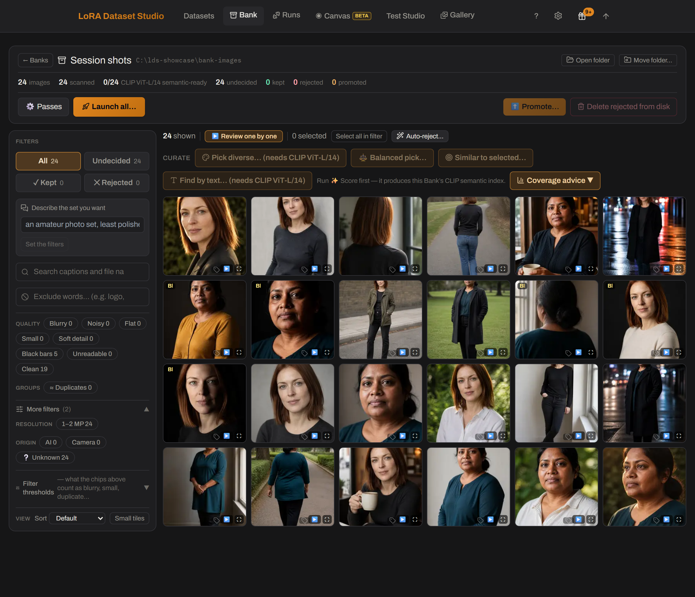
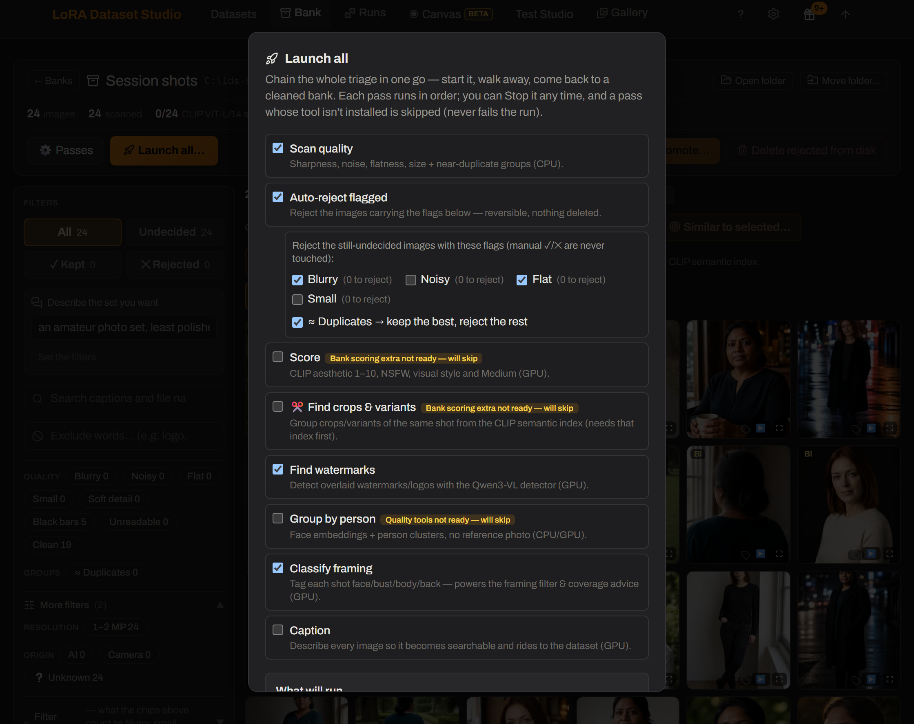
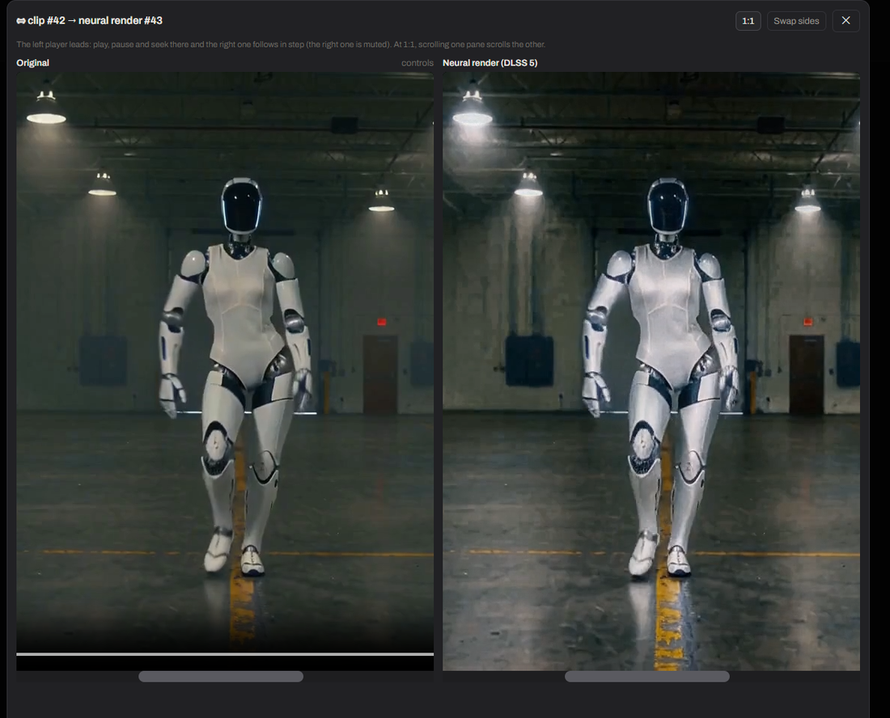
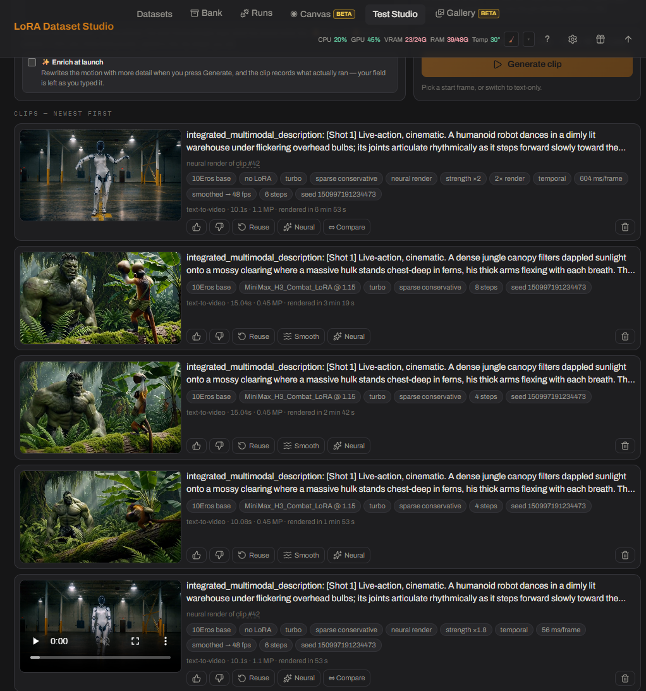
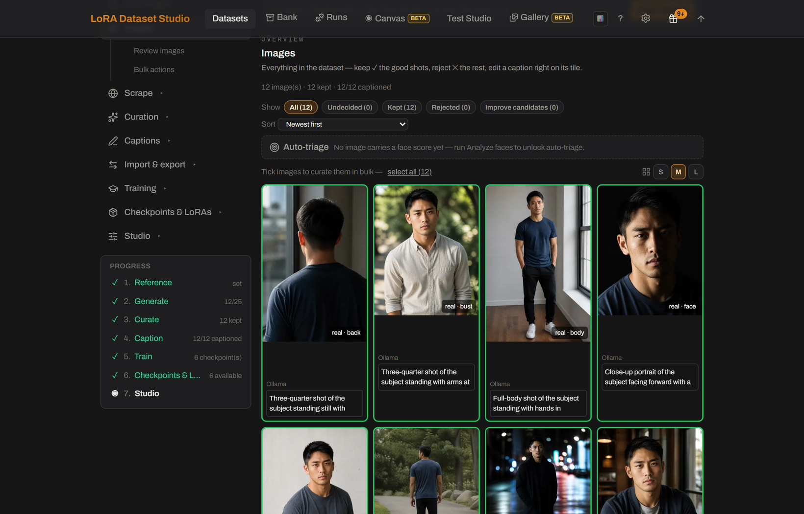
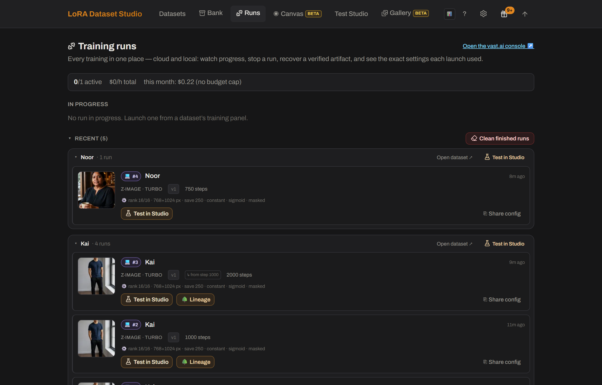
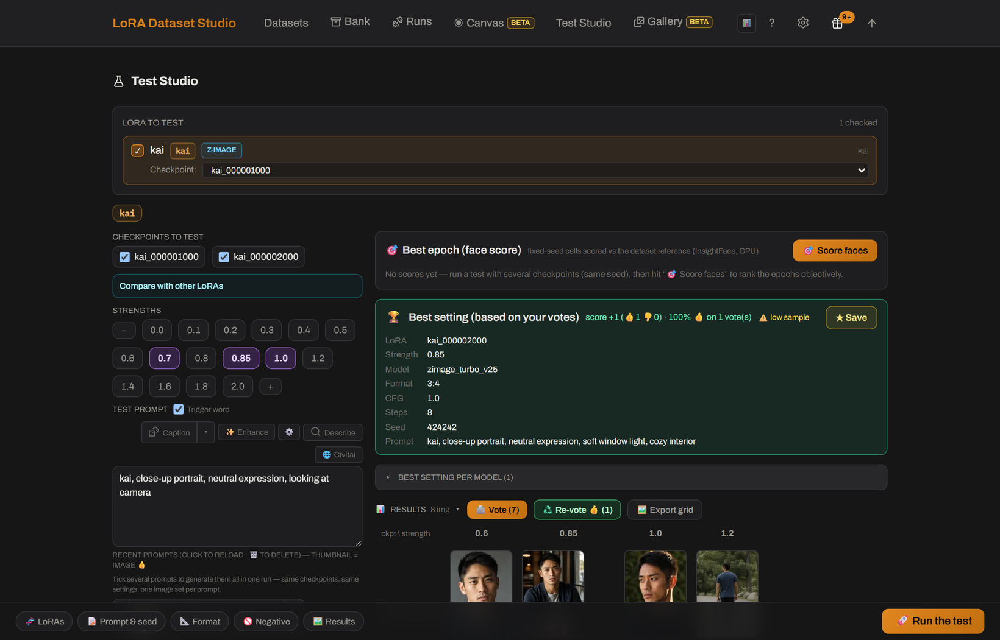
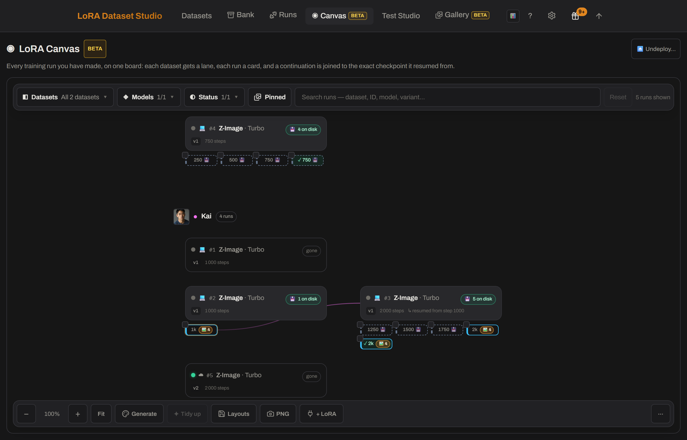

# FLT - Fresh LoRa Trainer

[](https://github.com/Fr3sher/FLT/actions/workflows/ci.yml) [](https://discord.gg/j6hnJBFtXE) [](https://github.com/sponsors/perfectgf) [](https://ko-fi.com/perfectgf)

[Install](#setup--install) · [Documentation](docs/README.md) · [Plugins](#plugins) · [Releases](https://github.com/Fr3sher/FLT/releases) · [Discord](https://discord.gg/j6hnJBFtXE)

No account, paid tier or telemetry. API engines and rented GPUs are optional; local and manual workflows remain available.
There is no upsell in the app: optional cloud signup referral links are disclosed and do not change the price.

<h3 align="center">☕ Keep the project in development</h3>

<p align="center">
  <a href="https://ko-fi.com/perfectgf"></a>
</p>

<p align="center">
  <strong><a href="https://ko-fi.com/perfectgf">ko-fi.com/perfectgf</a></strong> — one-off, no account needed, from the price of a coffee.<br>
  No paid tier, now or ever, so this is what funds the work: the API credits and rented GPUs every release is tested on, and the hours that go into the next one. <a href="#support-the-project">What it pays for →</a>
</p>

> New here? Start with [Setup & install](#setup--install), then follow the [end-to-end workflow](docs/guide/workflow.md). The [documentation index](docs/README.md) links every guide. Project news and current development live on [Discord](https://discord.gg/j6hnJBFtXE).

### 📖 [The complete guide — every feature, screen by screen →](docs/guide/using-the-app.md)

Everything the app can do, in one long read: [getting started](docs/guide/getting-started.md) · [the full workflow](docs/guide/workflow.md) · [every setting explained](docs/guide/settings-reference.md) · [Docker](docs/guide/docker.md) · [troubleshooting](docs/guide/troubleshooting.md).

### ▶️ Watch the whole thing, start to finish

A real Character LoRA built end to end in seven minutes, unedited and without narration:

https://github.com/user-attachments/assets/d51ff89c-34e9-41a9-b47d-08939a8c867b

People shown in the demo and screenshots are AI-generated.

## What it does

| Area | Capabilities |
|---|---|
| Datasets | Character, Concept and Style workflows; image and ZIP/folder import; subject-aware shot catalogs; local Klein and Krea 2 Edit generation; reference editing and exact retries |
| Image Bank | Review folders in place, score quality, group duplicates and people, search by text or similarity, and build balanced shortlists to promote into datasets |
| Curation | Keep/reject, crop, mirror, rotate, face similarity, composition checks, editable watermark masks, text detection and recoverable cleaning |
| Captioning | Local vision models or JoyCaption, family-appropriate prose or tags, appearance policies, bulk editing, targeted re-captioning and external image/`.txt` round trips |
| Local training | Guided ai-toolkit recipes for Z-Image, SDXL, Krea 2, FLUX.1, FLUX.2 Klein, Anima and Qwen-Image 2.1; queues, advanced settings, checkpoint continuation and experimental slider LoRAs |
| Review and testing | Generate with all seven image training families; fixed-seed checkpoint/strength comparisons, prompt batches, runs, logs, lineage, votes, rankings and a generated-image Gallery |
| Files | Standard training ZIPs and sidecars, backup/restore without API keys, ComfyUI deployment, configurable storage and Trash |

Dependencies vary by feature. Bank search ranks matches; it does not guarantee exclusions. Undo covers specific actions, and **Delete rejected** can remove source files after confirmation. Video and slider workflows are experimental. See the [feature reference](docs/guide/features.md), [requirements](docs/guide/requirements.md) and [known limitations](docs/guide/known-limitations.md) for the detailed behavior.

## Plugins

Install optional features from **Plugins → Store**, configure and prepare them in their own settings, and update them through **Plugins → Updates**. Several plugins can be installed together with one LDS restart. Each is independently installable; model downloads, hardware and provider credentials depend on the feature.

Point a bank at a folder, or scrape straight into one. It reads what is there **in place**: your files are never modified, moved or renamed, and the single action that does touch the source folder announces itself in capitals before it runs. Then **one pass measures the whole pile**, and every question afterwards is answered against those measurements instead of against your eyes — what is blurry, what is a duplicate of what, who is in it, how it is framed, whether it is a photograph or a render, and what it actually shows. You keep, reject and shortlist; a kept selection graduates into a dataset with its analysis attached, and can come back the other way.

The cuts are measured rather than guessed: the aesthetic and near-duplicate thresholds were calibrated on a real bank of **7,316 images**, and every measure that cannot answer says "unsure" or "not measured" instead of inventing a verdict. The image lane is out of Beta; the **video** lane still carries the chip, and says why below.

<table>
  <tr>
    <td width="62%" valign="top">
      <a href="docs/screenshots/bank/bank-analyze-and-overview.png"></a>
    </td>
    <td width="38%" valign="top">
      <a href="docs/screenshots/bank/bank-launch-all.png"></a>
    </td>
  </tr>
  <tr>
    <td valign="top"><sub><strong>The workspace</strong> — every pass on the left, and on the right what the bank actually <em>is</em>: how much of it each pass has covered, its resolutions, framings, mediums, and how many duplicate and person groups are still unresolved. Every number here is measured, never assumed: a pass that has not run says so instead of showing a zero.</sub></td>
    <td valign="top"><sub><strong>Launch all</strong> — the whole triage in one go. Every flag quotes what it would reject <em>today</em>, and says out loud that 3,602 images have not been scanned yet, so those counts will grow. Stop it any time; a pass whose tool is missing is skipped, never failed.</sub></td>
  </tr>
</table>

| Capability | What it provides |
|---|---|
| **Folder or web scrape → bank** | Inventory a live folder in place, or scrape into a new/existing bank without applying dataset filters on the way in |
| **One scoring pass, many answers** | A single pass produces aesthetic, NSFW and style rankings, groups, and embeddings every later feature reuses instead of re-inferring |
| **Quality and similarity passes** | Flag blur, noise, flat frames, small/soft-detail images and black bars; group duplicates, crops and recompressions — then, in a second pass, the near-duplicates only an embedding sees, with a per-run threshold and its own groups kept apart from the pixel ones |
| **Auto-reject by flag** | Turn any set of quality flags into a bulk rejection in one click, on the number it will really reject rather than the number flagged — and undo it as one decision |
| **People, framing and captions** | Cluster faces without a reference, classify face/bust/body/back, and caption the bank for full-text search — choosing the engine, the vision model and the pile per run, without changing your settings — kept + undecided by default, or kept, undecided, unkept (the bin) or all. Aiming a pass at the bin is never the default and states what it costs, and the button quotes the number it will actually write rather than the size of the pile. Every caption records **who wrote it** — the engine, or you — so once a pile is fully captioned, **Re-caption** redoes it with another model while keeping the ones you wrote or corrected by hand, unless you tick the box that rewrites those too. It counts the three cases before you click, including the captions written before the app tracked authorship: those cannot be told apart, and no undo covers captions |
| **Medium and head angle** | Split a mixed dump into photographs, anime, 3D renders and illustrations (reusing the scoring embeddings, no new inference), and filter by frontal / three-quarter / profile / back view. Both answer "unsure" or "not measured" instead of guessing, and both say so on screen: non-photo verdicts are rare by design, and profiles are under-counted because a hard-turned head often defeats face detection |
| **Find and shortlist** | Find by text, pick diverse, make framing-balanced picks, find similar images, or promote a shortlist into a new bank. You can also describe the set you want in a sentence and let the app set its own filters from it: the model reads the words only, never your images, so it moves the same chips you can edit and the counts beside them stay the measured ones. It says when a request has nowhere to land rather than inventing a filter, and it will not turn an exclusion into a search phrase, because the ranker returns more of a negated thing, not less |
| **Coverage advice** | A green readiness meter says the set is big enough; it does not say the set is varied. Coverage reads the labels, the scoring embeddings and the captions to name what the pool never shows — no profile views, one outfit, eye level only — because twenty-five versions of one photograph pass every other check. Advice only: nothing is kept or rejected, and what could not be measured says so instead of drawing an empty bar |
| **Fast review tools** | Filter, sort, review one by one, rotate without rewriting the source, compare an improved candidate with its original, and re-run only eligible passes |
| **Editable watermark masks** | Detect marks, redraw several mask zones, then crop or repaint into a separate clean derivative. Your source file is never written to: the clean copy lives beside it, and each level asks which pile it should run on (kept, undecided, unkept or all) before touching anything. Undo drops the clean copy and restores the original as the one in use, for the whole bank rather than a single run, and it skips any image whose source changed on disk since; an image already promoted into a dataset keeps the cleaned copy that went with it |
| **Crop and upscale in the bank** | Reframe a shot or re-render it at a higher resolution without leaving the bank — no promote-into-a-dataset-and-export-back detour. ✂ Crop is per image, in Review, and **resamples nothing**: a bank sits upstream of the training resolution, so the cut keeps its pixels and the dataset still decides the size when it imports. ✨ Upscale & improve is a scoped background pass on Klein or SeedVR2 — it needs ComfyUI and a GPU, spends minutes **per image**, and replaces what the bank shows rather than producing a candidate to validate. Your files are never written to: both land in a copy the app keeps, ↩ Revert throws it away and hands back any rotation the edit absorbed, and every measurement taken from the old pixels is cleared so the passes re-read the image you are keeping |
| **🔤 Find text** | Read burned-in lettering — speech bubbles, subtitles, captions, Latin or CJK alike — into the same mask funnel the watermark tools use, so 🧽 Repaint erases it and ✂ Auto-crop never touches a bubble. CPU-only, on the same small offline OCR the Video Bank uses; try it on a sample first and tune a stored sensitivity before committing a 9,000-page bank. Very stylised sound-effect lettering can still escape the reader — the mask editor covers those |
| **Dataset ↔ bank round trip** | Promote bank keepers into a dataset or copy dataset keepers into a bank while retaining compatible metadata and provenance |
| **Safe bulk work** | Undo the last bulk decision, tune thresholds where you work, move a bank without losing analysis, or run the full chain overnight |
| **The one destructive action** | Everything above leaves your files alone — 🗑 **Delete rejected** is the single bank action that touches the source folder. It sends the rejected files to the OS trash (or the app's own, or deletes them) behind a type-DELETE confirmation that first states how many files, where they go, and which other banks share that folder. It refuses outright when the folder is also a dataset's |

<p align="center">
  <a href="docs/screenshots/bank/find-text-launch.png"></a><br>
  <sub><strong>🔤 Find text</strong> — burned-in lettering becomes mask zones the same 🧽 Repaint erases. In a bank's Watermarks panel (datasets carry it too); try a sample first, then commit the pile.</sub>
</p>

### Video Bank *(Beta — first release, read the limits)*

Turns long source videos into a **video training set**: a flat folder of `.mp4`
clips with matching `.txt` captions, cut to the exact frame count and frame rate
the target model accepts.

| Capability | What it provides |
|---|---|
| **Folder → video bank** | Point a bank at a folder of videos. It is referenced **in place**: no pass ever writes to it, exactly like the image bank. The one thing that adds to it is a scrape you send to that bank yourself |
| **Automatic shot detection** | Finds the cuts with TransNetV2, so a long file becomes individually reviewable shots instead of one blob |
| **Review without waiting** | The grid shows thumbnails; a click plays that shot from the source, so nothing is encoded before you have decided |
| **Target-aware cutting** | Pick the model you are building for and the clip length offers **only counts that model can actually ingest** — Wan wants 4n+1 frames, LTX 8n+1, MiniMax H3 five modulo seventeen, and none of them will tell you if you get it wrong |
| **Encode only what you keep** | Cutting a clip means re-encoding it, so that is paid once, at promotion, for the clips you kept. A bank of 400 shots you triage down to 120 encodes 120 files, not 400 |
| **Fix a bad cut instead of rejecting it** | Trim either bound (by 1 s or one frame *of your source*), split a shot at the playhead, or draw a shot the detector missed. Bounds only — there is no scrubbable timeline. For image-to-video targets the first frame is the conditioning image, so moving a start picks what the model animates from, and the panel says so |
| **Measure every shot, choose your own cuts** | One pass reads every frame and scores stillness, blur, black moments and frozen stretches. Flags mark shots to *look at* — nothing is auto-rejected — and there are **no default thresholds**: a preview shows how many shots each cut would flag against *your* bank's own distribution before you apply it |
| **Sound measured, not assumed** | For the targets that keep an audio track (LTX, MiniMax H3), every shot is scored for **how much of it is silence** and its **level in dBFS** — because a dataset of silent clips teaches the model to be silent and the file on disk gives nothing away. "No track", "silent" and "not measured yet" stay three different answers |
| **Cap one source's share** | Optional cap on how many clips a single file contributes, so a 50-clip set is not quietly three videos over-represented. Keeps each source's earliest clips (same bank, same dataset — not a random sample), and the result reports the share it ended up with |
| **Trim the transition off both ends** | Optional per-export trim of both bounds (0 by default). A clip the trim makes too short for the target's frame count is **dropped, never exported short** — and counted separately from clips that were never long enough, since only one of the two is fixed by lowering the trim |
| **Train it without leaving the app** | A promoted set gets a ▶ Train button that runs it through the ai-toolkit installed here — no export, no hand-written config. It queues behind the same GPU as everything else: a captioning pass, a ComfyUI render or an image training in flight refuses the launch instead of racing it |
| **Shots described in words** | A pass writes what HAPPENS in each shot ("a woman turns and walks away"), which becomes the clip's `.txt` — the prompt it trains on. Captions are drafts: editable per shot, and a re-run never overwrites what you wrote |
| **Spot the shot you already have** | A pass compares every shot to every other and groups the near-identical takes — ten copies of one gesture do not teach a model ten things. Each pile keeps its **sharpest** member unflagged, so you know which one to keep, and flagged shots can be selected and rejected in one gesture. It costs no GPU and no new decode: it reuses the frame vectors *Find a scene* already cached |
| **Spot the watermarked shots** | A logo burned into the same corner of every frame is the most consistent thing in a dataset, so it is the first thing a LoRA learns to draw — and it is invisible at thumbnail size. An optional pass runs the same detector the image bank uses over each shot's sharpest frame and flags what it finds. Needs the watermark detector from Setup; a shot it could not judge is counted apart and reported as one it **could not judge**, never folded into the clean ones |
| **See the bands and the subtitles before the model does** | A subtitle sits in the same rectangle of every frame of every clip from one source, so a LoRA learns it early and then draws letter-shaped gibberish there forever; letterbox bars survive a training crop. An optional pass measures both on three frames of each shot — flat bands on all four sides, and text that HOLDS STILL across those frames, so a shop sign in a pan is left alone as scene content — then reports the rectangle a crop would leave you and how much of the frame that is. Three cuts read it, all empty by default. Reading text needs one small CPU package from Setup; **without it the pass still measures the bands and says so**, rather than reporting a bank with no text in it |
| **Catch the encoding damage the eye misses at thumbnail size** | One ffmpeg sweep per file measures three things the existing metrics are blind to: **duplicated frames** (12 fps anime padded to 24, pulldown — every average stays healthy, the model still trains on each picture twice), **compression blocking** (the macroblock grid of a starved re-encode, measured directly instead of guessed from the bitrate), and **edge blur at full resolution** — which is what an **upscale** looks like, and the sharpness score computes on a 160 px copy where a 480p upscale and a native 1080p are literally the same image. Three cuts, empty by default; the file cards also show each source's codec profile and bits-per-pixel |
| **Find a scene by typing a word** | One pass looks at a few frames of every shot; after it, typing *a woman walking on a beach* ranks the bank instantly and tells you **which second** of each shot matched. Several frames per shot, so a subject that only appears at the end is still findable. It is a **ranking, not a filter** — every shot scores something against every phrase — and the model **ignores "without"**, so `-word` pushes something down instead |
| **Triage one keystroke per shot** | ⌨ Burst mode above the gallery puts a cursor on one tile: K keeps, R rejects, P puts it back to untriaged, S or → moves on without deciding, ← steps back. Same keys as the image bank, nothing auto-decided |
| **Sort shots by what the camera did** | A 🎥 Camera pass tracks every frame of every shot and labels the move (pan, tilt, push-in, pull-out, handheld, locked off…), so a bank of a thousand shots can answer "which of these are static" and the clip's caption can say it |
| **Find the shots that are secretly two shots** | A pass flags the soft cuts detection misses (a dissolve, a match cut, a new angle in the same room) so a "shot" that is really two scenes gets reviewed instead of teaching the model a transition nobody asked for |
| **See which shots may be generated rather than filmed** | A CPU-only 🤖 AI check flags clips whose motion is too regular to have been filmed (a generated clip passes every other check at thumbnail size). A flag to look at, never an auto-reject; not yet calibrated against a large set of known generated clips |

**What it does NOT do yet**, plainly:

- **"Most varied" selection is still to come.** Shots do carry a look score now
  (the same LAION aesthetic scale as the image bank, read off the vectors 🔎
  Find scenes already caches) — but diversity-aware picking is not built yet.
  Searching by words ranks shots by what they LOOK like, which is a different
  question from whether they are any good.
- **Near-duplicates are found, but the threshold is inherited, not measured on
  video.** ✂ Duplicates groups shots at a cosine cut carried over from the image
  bank's own calibration over the same CLIP space; no video-pair calibration
  exists yet. It also compares two shots at their *closest* pair of frames, which
  reaches any given cut more easily than a single-image comparison — so on a bank
  of similar-looking material, expect to raise it.
- **No audio captioning, and no audio in the search.** The sound is measured
  (silence and level) but never described, and 🔎 Find scenes reads frames only —
  "a door slamming" describes nothing it can see.
- **Captioning is per-shot prose, not tags.** Every promoted clip gets a `.txt`:
  its caption when it has one, and an **empty** file when it does not. The file is
  always written, because a missing one crashes one trainer and makes another drop
  the clip silently — and an empty one trains uncaptioned, which is why the build
  dialog counts them out loud before encoding.
- **Training starts here, but only one target is proven here.** A promoted set
  has a **▶ Train this dataset** button that hands the clips to the ai-toolkit
  installed on your machine, and the cloud lane rents a pod for the same set. The
  eight offered targets (Wan 2.1 T2V and I2V, Wan 2.2 T2V and I2V A14B, Wan 2.2
  TI2V-5B, LTX-2 and 2.3, MiniMax H3) are exactly the video architectures that
  ai-toolkit ships, and each one's settings were read in its code — plus a
  "Generic / other" escape hatch that imposes no frame rule at all. But **Wan 2.2
  14B is the only one a finished run has been through here**, and the card says so
  on the others. Measured on that run: 24 GB was full, at 170-185 s per step, with
  the CPU offload that makes 24 GB possible at all. Only three bases are stated by
  anything installed locally, so **five of the eight need you to name a base
  repository** — both I2V Wan variants, Wan 2.2 TI2V-5B, and both LTX-2 versions.
- **The cloud lane names what it is billing.** The **☁ Train in the cloud** panel
  shows the GPU and its hourly price as soon as the pod reports them — while the
  run is alive, not before you click — and before the job starts it asks the pod
  to decode one of the clips you just uploaded, so a machine that cannot read them
  fails in the first minute instead of billing hours of training on nothing. A
  target with no verified base repository is **refused with the reason** rather
  than launched on a guessed repo id; the base can only be supplied through the
  API today, not from the panel. Wan 2.2 **A14B** saves each checkpoint as a
  **pair** (high-noise and low-noise experts) — the 5B does not — and both files
  are offered together, because either one alone is a LoRA nothing can load.
- **MiniMax H3 needs about 43 GB of weights, and will say so rather than fetch
  them.** They come from `Comfy-Org/MiniMax-H3`. If they are not on your disk the
  button names the repository and the size and waits for a yes — a first run that
  quietly downloaded 43 GB would look like a training that had hung.
- **MiniMax H3 is licence-restricted.** Its community licence grants no rights in
  the EU, the UK, South Korea or the USA, and the restriction covers the model's
  outputs, not only the model. Check your own territory before using that profile.

### Curate, caption and clean

| Capability | What it provides |
|---|---|
| **Curation grid** | Keep/reject, crop, mirror, rotate, zoom, resize, multi-select and non-destructive upscale candidates from either engine — Klein re-renders detail (sharper, but skin and colour can shift), SeedVR2 resolves detail and leaves the original look alone |
| **Identity and composition checks** | InsightFace similarity, score-based auto-triage, framing badges and a live Character composition meter |
| **Model-matched captions** | Prose or booru form selected by target family, with kind-aware Concept leak checks and content-only Style rules |
| **Appearance policy** | On a character dataset, choose per trait whether captions *omit* or *describe* hair, makeup and nails, facial hair, and glasses, so what stays unnamed binds to the trigger on purpose (face, eyes, skin, age, gender and ethnicity stay omitted); changing the policy offers a targeted re-caption |
| **Caption Lab and recovery** | Find/replace, tag frequencies, expanded editing, targeted re-captioning, stoppable batches and reload-proof recovery |
| **External caption round trip** | Export ordinary image/`.txt` pairs, caption them in any tool, then re-import without duplicating images or overwriting non-empty LDS captions |
| **Dual long + short captions** | ai-toolkit text-side augmentation for supported local families; both wordings remain editable per image |
| **Watermark review** | Detect, review and edit masks; choose crop, LaMa inpaint or a Klein whole-photo re-render (found zones erased first); every edit keeps an `.orig` backup and **Restore original** supports another attempt. 🔤 Find text feeds the same funnel with burned-in lettering (speech bubbles, subtitles), on datasets as on banks |

### Train, compare and continue

| Capability | What it provides |
|---|---|
| **Guided local training** | ai-toolkit underneath, family-scoped starters, adaptive step policies, launch guards, queueing and advanced controls |
| **Slider LoRA (Beta)** | Train a bipolar conceptual slider from positive and negative prompt poles, so LoRA strength moves the learned trait in either direction and Test Studio can sweep both sides |
| **Cloud training** | Rent a [vast.ai](https://cloud.vast.ai/?ref_id=683073) GPU from the same launch flow, stream progress and checkpoints home, and terminate pods automatically |
| **Parallel cloud runs** | Run several cloud trainings on one dataset at once to A/B toolkit settings — each run rents its own pod (billed separately), capped by the concurrent-runs ceiling in Settings |
| **Full-model training (Krea 2)** | Train the whole transformer instead of an adapter. The finished master lands on your own disk and is verified before the pod is destroyed, appears in 📦 Checkpoints & LoRAs next to the ~10 GB fp8 twin ComfyUI loads, and can be continued from the step written inside it. The lane is cloud-only and Krea 2 only, and it accepts Raw, Turbo or a Krea 2 checkpoint of your own. Turbo is allowed with a warning nobody can honestly skip — a full-model run on a distilled base has not been measured, by us or by anyone, and it may cost the model its few-step behaviour. A ComfyUI scaled-fp8 export is refused outright as a base: the trainer cannot load one |
| **Merge a LoRA into a checkpoint** | Fold one or more of your LoRAs into a base, each at its own weight, and get a complete model you can publish. A plan answers first, from the file headers alone: how many tensors change, how big the output is, which drive it lands on, how long it takes, and what a half-way failure leaves. What comes out is a **merged** model, not a trained one — the file's own metadata records the base, every LoRA and its weight, so it stays true after a rename. It is also the published route to getting few-step speed back on a Raw full model, by folding in the re-distillation LoRA Krea publishes for Turbo; that one we have not tested ourselves, and the screen says so before you start it |
| **Custom bases and continuation** | Train compatible custom weights, continue from any saved epoch, or use verified full-state resume where available |
| **Runs** | Local and cloud runs together with progress, logs, stop/retry/continue/download actions and paste-safe config sharing |
| **Experiment lineage** | Inspect, annotate and diff the exact tree of runs and the checkpoint each continuation resumed from |
| **LoRA Canvas** | Put every dataset's lineage on one pan/zoom board, rearrange cards, compare runs across datasets, generate from same-family checkpoints — including 🧬 blending several checkpoints into one image, with purple provenance edges joining a blended picture to every pill it came from (blends made before this feature show a badge instead) — pin/fuse outputs and continue training from a pill; each generation run keeps its own strip in training-step order, with the character dataset's reference face on its lane. A 🔌 + LoRA button pins any LoRA from your ComfyUI folder onto the board as its own plugin node, with its own strength — it stacks onto a run anchored by a checkpoint trained here, not as a solo generation on its own. ⏏ **Undeploy** lists every LoRA the app has put into ComfyUI, across all datasets and families, and removes the ones you tick in one pass — only what the app deployed is listed, so LoRAs you downloaded yourself are never shown or touched, and the training saves are kept so anything removed can be deployed again |
| **Test Studio** | Fixed-seed checkpoint × strength grids, multi-LoRA comparisons or 🧬 combined stacks (several of your LoRAs in one image, each at its own weight, weight variants compared side by side), a ✨ Enhance button that enriches your prompt through your local LLM, votes, Wilson ranking, face ranking and shareable exports |
| **📝 Prompt batch** | Tick several prompts — from the saved history, from 🎬 Scenes or from the 🌐 Civitai browser — and one launch renders them all: one image set per prompt, same checkpoints, same settings, same seed. The cost counter multiplies by the batch before you click, not after. On every launch surface, the multi-LoRA comparison included |
| **🎬 Scenes** | Run a bank's or a dataset's captions in their order as one batch of prompt passes (a storyboard, a shoot, a chapter page by page), each shown with the image it came from, in the Test Studio and the board's 🎨 Generate; the 🎲 shortcut still draws one caption at random |
| **🖼 Gallery** | One feed of every image the app ever generated — Test Studio cells, Canvas previews, comparison runs and ✨ improvements — across every dataset, newest first, with dataset / renders-vs-improved / 👍 liked filters. The viewer walks the feed with the arrow keys and shows everything a picture was made from; ⬇ downloads keep the lineage name, ✨ Upscale & improve runs straight from the feed (the result lands at its top), and a Select mode deletes misses or ZIPs a pick. The feed loads itself as you scroll, on a phone as well as a desktop |
| **📷 Camera angles** | Re-photograph a generated image (Gallery viewer) or a kept dataset image from other camera positions — pick azimuths on a dial plus a camera height and a distance, read the exact prompts and the cost before you shoot, cancel any view from the queue. Runs locally on Qwen-Image-Edit with a Multiple-Angles LoRA through ComfyUI; Setup installs the whole stack from one card. On a dataset image the angle is written into the caption at birth ("seen from behind, low camera angle") and re-injected on every later captioning pass, because an angle left undescribed binds to the trigger word. New views land as pending candidates of the normal keep/reject cycle. The Bank stays out on purpose — it is the reservoir of real photos; promote first, then re-shoot |
| **🌐 Civitai top prompts** | Browse Civitai's most-reacted images of the day, week, month, year or all time, each shown next to the generation prompt it was posted with, and reuse one in a click — or tick several and render them all in one run, one image set per prompt on the same seed and settings, which is what makes them comparable. The same button on the dataset Test Studio, the multi-LoRA comparison and the board's 🎨 Generate. Not every image publishes its prompt (the browser keeps the ones that do by default), and reading prompts needs the free Civitai API key from Settings → Scraping & sources — the same single key the scraper uses. The content-level select is a ceiling, Safe by default |
| **🎬 Video Test Studio** | The same question as the image Studio, asked of a video LoRA: one clip per start frame, same seed and same prompt, so the clips differ by their picture and nothing else. Pick several start frames at once — files, bank tiles, Gallery images or a training clip — and one click queues one clip each. Every dial says what it costs (turbo, sparse attention, latent upscale, sampling steps), clips run to 15 seconds, and the history keeps the prompt in the engine's own format with every setting that ran and the time it took. From a finished clip: ↻ Reuse its settings, ≈ Smooth to twice the frame rate, ✨ Neural to re-render it |
| **✨ DLSS 5 Neural Rendering** | Re-render a finished clip through NVIDIA's DLSS 5 model — skin, hair and fabric gain structure the source only implied. In a dataset the render replaces the clip and the original is kept (Restore); in the studio it is a new clip beside the old one. **⇔ Compare** plays both side by side, in step, with a 1:1 zoom, because a neural render is judged in motion and not on a still. Strength, passes and a 2× working size push it past the model's default. Windows + NVIDIA only: Setup installs the bridge, you bring the model file — the app never downloads it and says so |
| **Studio shortcuts and recovery** | Open Studio directly from a run, draw prompts from kept dataset captions, and pause safely when ComfyUI drops instead of launching later cells against changed state |

<table>
  <tr>
    <td width="50%" valign="top">
      <a href="docs/screenshots/release/camera-angles-picker.png"></a>
    </td>
    <td width="50%" valign="top">
      <a href="docs/screenshots/studio/civitai-prompt-browser.png"></a>
    </td>
  </tr>
  <tr>
    <td valign="top"><sub><strong>📷 Camera angles</strong> — pick positions on the dial, read the exact prompts and the cost <em>before</em> you shoot. Lives in the Gallery viewer and on every kept dataset image.</sub></td>
    <td valign="top"><sub><strong>🌐 Civitai top prompts</strong> — the most-reacted images next to the prompt they were posted with; ⤵ drops one into your prompt field, ☐ Batch collects several for one run. Next to the prompt box on every generation surface.</sub></td>
  </tr>
  <tr>
    <td width="50%" valign="top">
      <a href="docs/screenshots/video/dlss5-compare.png"></a>
    </td>
    <td width="50%" valign="top">
      <a href="docs/screenshots/video/video-studio-clips.png"></a>
    </td>
  </tr>
  <tr>
    <td valign="top"><sub><strong>✨ DLSS 5 Neural Rendering</strong> — ⇔ Compare plays the original and the render together, in step, at 1:1. A neural render is judged in motion, not on a still.</sub></td>
    <td valign="top"><sub><strong>🎬 Video Test Studio</strong> — every clip keeps the prompt, the dials that produced it and what it cost; ↻ Reuse, ≈ Smooth, ✨ Neural and ⇔ Compare start from there.</sub></td>
  </tr>
</table>

### Keep control of the files

| Capability | What it provides |
|---|---|
| **Training ZIP and sidecars** | Standard kept image + same-stem `.txt` pairs for ai-toolkit/Kohya-compatible tools |
| **Portable backup and restore** | Datasets, decisions, captions, settings and run history in one file; API keys stay out |
| **Hugging Face publishing** | Publish kept pairs to a dataset repository, private by default and gated by an explicit rights confirmation |
| **Publish to Civitai** | Push a trained checkpoint and the images you pick to a Civitai model page without leaving the app — the page, the version and the pictures in one dialog. It is left as a **draft** so nothing goes public until you have read it back on Civitai. Uses the same free API key the prompt browser and the scraper already share |
| **ComfyUI deployment** | Deploy individual LoRA checkpoints or downloaded cloud results into the configured LoRA tree; a full model's fp8 twin goes to ComfyUI's own diffusion-models folder instead, hard-linked when it sits on the same drive so it costs no second copy. The full-precision master is never sent — it is the only file you can train from again |
| **Recoverable deletion** | Deleted app data goes to Trash; destructive Image Bank actions state their destination before confirmation |
| **Storage you can see and move** | Settings › Storage lists every folder the app writes to with its path and (on request) its size, and can point the dataset root, the cloud run staging and the checkpoint store at another drive — moving what is already there, or adopting the new folder empty, never silently. Trained checkpoints live in their own store that no cleanup touches; the trash sits on the same disk, so space returns only when you empty it. The same tab shrinks any full-precision `.safetensors` on this machine to the ~10 GB fp8 file ComfyUI loads, and chooses where a finished full model is delivered. |

### A quick visual tour

<table>
  <tr>
    <td align="center" width="50%">
      <a href="docs/screenshots/bank/bank-overview.png"></a><br>
      <sub><strong>Image Bank</strong> — score, search and shortlist large collections.</sub>
    </td>
    <td align="center" width="50%">
      <a href="docs/screenshots/03-curate.png"></a><br>
      <sub><strong>Curate</strong> — review, repair and balance the training set.</sub>
    </td>
  </tr>
  <tr>
    <td align="center" width="50%">
      <a href="docs/screenshots/training/runs-hub.png"></a><br>
      <sub><strong>Runs</strong> — follow local and cloud experiments together.</sub>
    </td>
    <td align="center" width="50%">
      <a href="docs/screenshots/studio/studio-grid.png"></a><br>
      <sub><strong>Test Studio</strong> — compare checkpoints at fixed seeds and strengths.</sub>
    </td>
  </tr>
</table>

<p align="center">
  <a href="docs/screenshots/canvas/canvas-board.png"></a><br>
  <sub><strong>LoRA Canvas</strong> — every run on one board, and the exact recipe behind each one.</sub>
</p>

The detailed journey, screenshots and operational notes now live in the [workflow guide](docs/guide/workflow.md).

### Roadmap

Directions, not dates. These are discussed openly on the project's Discord, and the most-requested ideas move up the list.

- **🧬 Merge Lab** *(its first bricks are live)* — baking your LoRAs into a standalone checkpoint has landed, and so has full-model training on Krea 2. What the Lab adds is the workshop part: per-block merge ratios, producing several variants of one merge and **comparing them side by side** in the Test Studio on fixed seeds, merging two checkpoints with each other, and a one-click "Turbo transplant".
- **🎬 Video LoRAs** — *the dataset, training and in-app test lanes now exist* (see **Video Bank** above): shot detection, quality measures (motion, exposure, freeze, audio), captions that describe the action, keyword search across shots, target-aware cutting into a trainable folder, a ▶ Train button that runs the set through your local ai-toolkit or a rented pod, and a Video Test Studio that renders a clip with the resulting LoRA. What remains is proving the targets beyond Wan 2.2 with a finished run each. Community-driven.
- **🧠 Watermark cleaning during import** — cleaning that happens **during import** instead of as a separate errand, and automation you can trust unattended. *(Detection keeps catching up: a dedicated detector that needs no vision model ships alongside the Ollama path, manual two-pass cleaning works in datasets and in the Image Bank — and 🔤 Find text now reads burned-in lettering, speech bubbles and subtitles into the same mask funnel.)*
- **🧩 More base models** — additional Flux-family bases (Chroma, Qwen-Image…) with the same one-click flow as Krea 2.

These are built on personal time, and how fast they arrive depends on how much of it there is. [**Support the project on Ko-fi ☕**](https://ko-fi.com/perfectgf) if you want to see them sooner.

## Why this instead of ai-toolkit?

"Instead of" is the wrong frame: this app is **not a competitor to [ai-toolkit](https://github.com/ostris/ai-toolkit) — it orchestrates it**. ai-toolkit is the training engine; FLT - Fresh LoRa Trainer adds the work before, around and after a run.

| Stage | ai-toolkit alone | FLT - Fresh LoRa Trainer |
|---|---|---|
| [API image engines](bundled/api_engines/) | Generate images with Gemini/Nano Banana, ChatGPT or OpenRouter; experimental ChatGPT subscription connection | Provider credentials; API usage is billed by the provider |
| [Camera angles](bundled/camera_angles/) | Create new viewpoints of Gallery or dataset images with controls for direction, height and distance | ComfyUI, Qwen-Image-Edit and Multiple-Angles LoRA |
| [Canvas](bundled/canvas/) | Arrange runs and checkpoints on a visual board, compare or blend LoRAs, generate images and export layouts | ComfyUI for generation; one model family per generation batch |
| [Cloud training](bundled/cloud_training/) | Train image or video models on rented GPUs, monitor runs, recover checkpoints and deliver full Krea 2 models | [vast.ai](https://cloud.vast.ai/?ref_id=683073) account and API key; Hugging Face access for applicable runs |
| [DLSS 5 Neural Rendering](bundled/dlss5/) | Improve a finished video's lighting and materials, compare with the original and export the result | Windows x86-64, NVIDIA driver, compatible model supplied by you and the prepared bridge |
| [Klein Improve](bundled/image_upscale/) | Re-render image detail with instructions, LoRA presets and finishing controls | ComfyUI and Klein models; appearance and color can change |
| [Live channels](bundled/live/) | Continuously render scripted H3 scenes and watch them in a browser or VLC | Compatible local ComfyUI, H3 weights and stream encoder; experimental |
| [Model tools](bundled/model_tools/) | Quantize full models to fp8 or merge weighted LoRAs into a base checkpoint | Python with PyTorch and output disk space; CPU processing, no GPU required |
| [Publish to Civitai](bundled/civitai_publish/) | Upload checkpoints and generated images to a model page | Civitai API key; checkpoints default to drafts, image posts default to publication |
| [Publish to Hugging Face](bundled/hf_publish/) | Export kept images, captions, metadata and a dataset card to the Hub | Write-enabled Hugging Face token; private repository by default and rights confirmation |
| [Resource monitor](bundled/resource_monitor/) | Show CPU, GPU, RAM, VRAM and temperatures, with guarded memory release | No model download |
| [SeedVR2](bundled/seedvr2/) | Restore and upscale images with high-resolution tiling and finishing controls | ComfyUI, SeedVR2 nodes and models; optional TTP nodes for tiling |
| [Video lane](bundled/video/) | Build video datasets from local files or web imports, curate shots, train LoRAs and test H3 generation, continuation and interpolation | Dependencies vary by task: PyAV/ffmpeg, ai-toolkit, ComfyUI and model weights; Video Bank remains beta |
| [Web scraping](bundled/scrape/) | Import selected images or clips from searches and supported gallery URLs into datasets or banks | Source-dependent credentials and permissions; Pexels requires explicit dataset/ML authorization |

API providers apply their own billing and content policies. Model licenses also apply, including MiniMax H3's territory restrictions; check the [video limits](docs/guide/features.md#video-bank-beta--first-release-read-the-limits) before using it. Plugin authors can start with the [SDK and package guide](docs/plugins/README.md).

## Screenshots

Click a screenshot to view it at full size.

<table>
  <tr>
    <td width="33%" align="center"><a href="docs/screenshots/bank/bank-overview.png"></a><br><sub>Image Bank</sub></td>
    <td width="33%" align="center"><a href="docs/screenshots/bank/bank-analyze-and-overview.png"></a><br><sub>Analysis and coverage</sub></td>
    <td width="33%" align="center"><a href="docs/screenshots/bank/bank-launch-all.png"></a><br><sub>Batch analysis</sub></td>
  </tr>
  <tr>
    <td width="33%" align="center"><a href="docs/screenshots/03-curate.png"></a><br><sub>Dataset curation</sub></td>
    <td width="33%" align="center"><a href="docs/screenshots/bank/find-text-launch.png"></a><br><sub>Text detection</sub></td>
    <td width="33%" align="center"><a href="docs/screenshots/training/runs-hub.png"></a><br><sub>Training runs</sub></td>
  </tr>
  <tr>
    <td width="33%" align="center"><a href="docs/screenshots/studio/studio-grid.png"></a><br><sub>Checkpoint comparisons</sub></td>
    <td width="33%" align="center"><a href="docs/screenshots/canvas/canvas-board.png"></a><br><sub>LoRA Canvas</sub></td>
    <td width="33%" align="center"><a href="docs/screenshots/studio/civitai-prompt-browser.png"></a><br><sub>Civitai prompts</sub></td>
  </tr>
  <tr>
    <td width="33%" align="center"><a href="docs/screenshots/release/camera-angles-picker.png"></a><br><sub>Camera angles</sub></td>
    <td width="33%" align="center"><a href="docs/screenshots/video/video-studio-clips.png"></a><br><sub>Video Test Studio</sub></td>
    <td width="33%" align="center"><a href="docs/screenshots/video/dlss5-compare.png"></a><br><sub>DLSS 5 comparison</sub></td>
  </tr>
</table>

## Setup & install

**Windows:** download `LoRA-Dataset-Studio-windows.zip` from [FLT's latest release](https://github.com/Fr3sher/FLT/releases/latest) when that asset is available; otherwise use GitHub's **Source code (zip)**. Extract the entire archive and run `start.bat`. The launcher prepares Python and opens FLT in your browser.

Complete **Setup**, then create a dataset and install the optional plugins you need. Importing, organizing and manually captioning images require no GPU or API key.

**Updates:** ZIP installations use **Update & restart** and retain their datasets, media, settings and history. Git installations follow their configured branch; this fork continues to use `main`. Pinokio and Docker use their own [update procedures](docs/guide/installation.md). Back up your data before the first v2 launch because it may migrate the database.

### Minimum requirements

The core runs without a GPU. Python 3.10–3.12 supports the local ML extras; the Windows launcher downloads Python 3.12 if needed. Local generation typically needs about 16 GB NVIDIA VRAM; training requirements depend on the family and settings. See the [hardware and dependency tables](docs/guide/requirements.md) before downloading models or renting a GPU.

### Option 1 — Git checkout (Windows)

```bash
git clone https://github.com/Fr3sher/FLT.git
cd FLT
start.bat
```

### Option 2 — manual venv (any OS)

Clone/download the source, open a terminal in its root, then run:

```bash
python -m venv .venv
source .venv/bin/activate        # Windows: .venv\Scripts\activate
pip install -r backend/requirements.txt
# optional local ML capabilities:
pip install -r backend/requirements-ml.txt
python backend/run.py
```

Only rebuild the frontend when changing `frontend/src`:

```bash
cd frontend
npm install
npm run build
```

### Option 3 — Docker + your existing ComfyUI

**Beginner Windows flow:** download/extract the **source** ZIP (GitHub ▸ **Code → Download ZIP**) — the release asset `LoRA-Dataset-Studio-windows.zip` does not carry the Docker launchers — start Docker Desktop, then double-click **`start-docker.bat`**. On the first run, select either the ComfyUI folder containing `main.py` and `models`, or its portable parent containing `ComfyUI\main.py`. LDS validates the folder and remembers it for this checkout.

Start your usual ComfyUI on the host. LDS uses `http://host.docker.internal:8188` from its container and mounts the selected folder at `/external-comfyui`. If the folder later moves, double-click **`configure-docker.bat`**. The launcher chooses a free Studio port and opens the browser automatically.

### Option 4 — Docker (GPU + ComfyUI)

**Beginner Windows flow:**

1. On GitHub, choose **Code → Download ZIP**, then extract the complete folder.
2. Start **Docker Desktop** and wait until it reports that Docker is running.
3. Double-click **`start-docker-gpu.bat`** in the extracted folder.
4. Leave the first build/start running; it downloads the image and ComfyUI environment. The launcher prints both actual addresses and opens Studio as soon as Studio responds, while its batch window stays open until ComfyUI finishes its first boot. You do not need to open a second ComfyUI window.

This creates a **fresh, isolated, repo-local** Docker setup: its own ComfyUI, models, application data and Image Bank folder live beside this checkout. **It never touches an existing ComfyUI by default.**

For either Docker launcher, choose Ollama only inside **LDS Setup**: **No Ollama**, **Existing host Ollama**, or **Docker Ollama**. The Docker companion is started only after that explicit choice, and no vision model is downloaded automatically. Pull the selected model from the LDS Ollama card to see progress and cancel it if needed.

The double-click launcher allocates free host ports atomically: Studio uses the first available port in `5050-5149`, and ComfyUI the first available port in `8188-8287`. If `5050` or `8188` is already occupied, the existing service is left running and another port is chosen automatically. Re-running the launcher from the same checkout reopens its current mapped ports without recreating the running container; a conflicting container owned by another checkout is reported and left untouched. The launcher does not edit `.env`.

Advanced CLI:

```bash
cp .env.example .env
mkdir -p run basedir data-docker-gpu bank-images
docker compose -f docker-compose.gpu.yml up --build
```

For the advanced CLI, the default addresses remain `http://127.0.0.1:5050/` for Studio and `http://127.0.0.1:8188/` for ComfyUI; `.env` can override them. This lane requires an NVIDIA GPU, a compatible driver and NVIDIA Container Toolkit support. Storage relocation, ports, existing-ComfyUI adoption, UID/GID, DNS, update commands, resource caps and operational limits are documented in the dedicated [Docker guide](docs/guide/docker.md).

### Option 4b — Docker, API-only (no GPU, any OS)

For a machine with no NVIDIA GPU: generation through Gemini/ChatGPT/OpenRouter, import and scraping, curation, manual captions, export and backup. ComfyUI and ai-toolkit stay out of this image, so local generation, Test Studio and local training are unavailable in this lane.

```bash
cp .env.example .env
mkdir -p data-docker
docker compose up --build          # docker-compose.yml, the default file
```

Studio answers on `http://127.0.0.1:5050/` and its data lives in `./data-docker`. This is the only Docker lane that needs no NVIDIA support at all.

To update any Docker install, double-click **`update-docker.bat`** (latest stable release; pass `main` for the preview channel) — it rebuilds transactionally and rolls back if the container does not come up healthy. Both `start-docker.bat` and `start-docker-gpu.bat` also accept `--rebuild` and `--update-rebuild`; `start-docker.bat` additionally accepts `--configure`, which is what `configure-docker.bat` calls.

### Option 5 — Pinokio (one click, any OS)

In [Pinokio](https://pinokio.computer), open **Discover → Download from URL** and paste `https://github.com/Fr3sher/FLT.git`, then click **Install** and **Start**. Pinokio builds the Python environment, installs the core requirements and opens Studio; **Update** fast-forwards the same checkout the in-app updater uses.

Only the core app is installed this way — ComfyUI, Ollama, ai-toolkit and the optional ML helpers are still connected from the app's own **Setup** screen. Updates go through Pinokio's **Update** tab: because Pinokio starts and stops the server, the app detects this install shape and shows *Stop → Update → Start* instead of its own **Update & restart** button, which would relaunch the server outside Pinokio's control.

### External tools (install once, connect in Settings)

| Tool | Unlocks | Connect it |
|---|---|---|
| [ai-toolkit](https://github.com/ostris/ai-toolkit) | Local LoRA training and JoyCaption | Set its directory and Python interpreter in **Settings → Local tools**; conda, uv, venv and portable Python installs are supported |
| [ComfyUI](https://github.com/comfyanonymous/ComfyUI) | Klein/Krea local generation, Studio, Canvas generation and deployment; SDXL base discovery | Keep its API reachable and set the install/models paths in **Settings → Local tools** |
| [Ollama](https://ollama.com) | Auto-captioning, framing, head-crop and watermark detection | In Docker, choose none/host/companion in **Setup**, then pull the model explicitly from LDS; native installs can use their configured URL |
| [LM Studio](https://lmstudio.ai) | The same, if that is the local model server you already run | Pick it in **Settings ▸ Local tools**. It only serves a model you have loaded (no JIT by default), and LDS cannot start it for you — its Developer tab has the switch |

Which of the two serves those features is a single setting (**Settings ▸ Local tools ▸ Local LLM provider**); Ollama stays the default. The full path rules, model layouts and provider states are in the [settings reference](docs/guide/settings-reference.md#local-tools). If a tool remains unavailable, use the [troubleshooting guide](docs/guide/troubleshooting.md).

### Getting API keys

| Service | Used for | Where to create it |
|---|---|---|
| Gemini | Nano Banana Pro | [Google AI Studio](https://aistudio.google.com) |
| OpenAI | ChatGPT / `gpt-image-2` | [OpenAI API keys](https://platform.openai.com/api-keys) |
| OpenRouter | Image models through OpenRouter | [OpenRouter keys](https://openrouter.ai/keys) |
| Pexels | Optional official-API image search | [Pexels API key](https://www.pexels.com/api/key/) |
| Hugging Face | Gated weights and optional publishing | [Hugging Face tokens](https://huggingface.co/settings/tokens) |
| vast.ai | Optional cloud training | [vast.ai console](https://cloud.vast.ai/?ref_id=683073) (referral link — disclosed below) |

> **Affiliate disclosure.** The vast.ai links in this README, in the guides and in the app are referral links. If you create an account through one of them, vast.ai pays this project 3% of what you spend on their platform, for as long as your account lives. It costs you nothing extra — vast.ai's prices are the same either way — and it changes nothing in the app: the cloud lane was vast.ai-only before these links existed and still runs on your own API key, vast.ai bills you directly, and the app sends no data about you anywhere. If you would rather not, use the untagged link: <https://cloud.vast.ai/>

Secrets saved in Settings live in the git-ignored `.env`, never in `config.json` or a commit. Full-model Krea 2 cloud runs use a separate `HF_CLOUD_TOKEN`; a narrowly scoped fine-grained token is recommended, while a global `role=write` token is accepted with a broad-access warning and read-only is rejected. Follow the [cloud-token instructions](docs/guide/settings-reference.md#cloud-training).

> **Pexels authorization required:** An API key alone does not authorize dataset or machine-learning use. Configure this integration only if Pexels has explicitly authorized this use case, and keep the attribution LDS displays. Read the [official Pexels terms and conditions](https://help.pexels.com/hc/en-us/articles/900005880463-What-are-the-Terms-and-Conditions/).

## Minimum requirements

The app scales from "no GPU at all" to a full local training rig — each capability has its own floor, and missing pieces are hidden or guided through Setup.

| Mode / capability | GPU (NVIDIA) | Disk | Notes |
|---|---|---|---|
| **API-only** (Gemini/ChatGPT/OpenRouter generation, import/scrape, curate, manual captions, export/backup) | none | ~2 GB | Any machine with Python 3.10+ (3.13/3.14 run the core app fine — the 3.10–3.12 window is an ML-extras constraint); Docker image available |
| **Auto-captioning & framing** (Ollama vision, 8B model) | ~8 GB VRAM | ~7 GB | Runs alongside generation, not concurrently |
| **Local generation** (Klein 9B **KV** fp8 via ComfyUI) | ~16 GB VRAM | ~30 GB (model + text encoder + VAE) | Free, local and NSFW-capable; Setup downloads the models. The KV build is up to **2.5× faster on multi-reference edits** at the same quality. Available in Docker GPU mode |
| **LoRA training — Z-Image / SDXL** (ai-toolkit) | 16 GB+ recommended | 10 GB+ free enforced per run | Quantized (qfloat8) + low-VRAM mode |
| **LoRA training — Krea 2** (ai-toolkit) | **24 GB VRAM** at 1024 px (enforced warning) | ~24 GB base download (Raw), or none if you start from a Krea 2 checkpoint you already have, + 10 GB+ free | Under 24 GB, select **Resolution → 768 only** in Advanced options |
| **LoRA training — FLUX.2 Klein** (ai-toolkit) | 4B: **16–24 GB VRAM** · 9B: **32–48 GB** | base download + 10 GB+ free | Both bases are gated on Hugging Face; the cloud lane is practical for 9B |
| **LoRA training — FLUX.1 / Anima** (ai-toolkit) | ~24 GB VRAM (both are 12B-class families) | base download + 10 GB+ free | **Local only — neither has a cloud lane.** FLUX.1 is gated on Hugging Face; Anima's base is public and reads booru tags natively |
| **Full-model (dense) training — Krea 2** (experimental, cloud only) | **80 GB VRAM** — there is no local lane | 200 GB on the pod, plus a private Hugging Face repo for the ~26 GB master | Not the recommended path: Krea's own advice is a LoRA on Raw applied to Turbo. Needs a separate `HF_CLOUD_TOKEN` |
| **Face scoring / person masks / watermark inpaint** (ML extras) | none (CPU) | ~3 GB (+ CPU torch for LaMa) | Python **3.10–3.12 required** for wheels; installable per capability from Setup |

- **OS:** Windows 10/11 for the full local stack (`start.bat`). Linux/macOS work for API-only + manual venv; GPU Docker depends on host NVIDIA support.
- **Python:** 3.10–3.12, but not required up front: `start.bat` fetches a self-contained CPython 3.12 when none is installed. Python 3.13+ can run the core app but not the ML extras.
- **RAM:** 16 GB+ recommended for local training. Unlike VRAM and free disk, this one is a recommendation the app never measures — a run that dies for want of system memory has no guard-rail in front of it.
- **Dataset size:** a launch is gated on a per-family floor — 12 images for Z-Image, 15 for Krea 2 / FLUX.1 / FLUX.2 Klein, 20 for SDXL, 4 for a slider LoRA — with 20-30 recommended. Below the floor the app asks you to confirm and warns about overfitting rather than refusing outright.
- Reference development rig: RTX 4090 (24 GB); every number above was measured or enforced there.

## Configuration & network access

Use **Settings** for normal configuration. Native installs bind to `127.0.0.1` by default. Read the [security policy](SECURITY.md#the-default-threat-model) before enabling network access; a protected connection also lets you use LDS from a phone or tablet.

The server binds to `127.0.0.1` by default. Before enabling LAN access or publishing a port, read [SECURITY.md](SECURITY.md#the-default-threat-model) and configure the access-token/VPN/reverse-proxy boundary that fits your network. The whole interface also works on a phone or tablet on your own network, so checking a run or triaging a bank does not need the machine that is training.

**What leaves this machine.** There is no telemetry and no analytics: nothing about you, your images or your datasets is sent anywhere. The app does reach the internet in four situations:

- **Update check** — on load and once an hour, it asks GitHub whether a newer version exists (a `git fetch` on a checkout, the releases API on a packaged install). It sends nothing about you, and there is currently **no setting to turn it off** — block the process at the firewall if you need it silent.
- **Model downloads you start** — Setup and the Install buttons stream weights from Hugging Face, Civitai, Ollama and pytorch.org. Two extras also fetch their own weights the first time you use them: the aesthetic head (~13 MB, from GitHub) and the NSFW classifier plus SigLIP 2 (Hugging Face).
- **API engines and cloud training you configure** — only the providers whose keys you entered, and only when you press the button. OpenRouter additionally receives this project's public name and repository URL as attribution headers.
- **The built-in scraper** — the sites you ask it to scan, and nothing else.

When the app is served on an address the public internet can reach — a rented pod's proxy hostname, a tunnel — set `LDS_PUBLIC=1`. That forces the access token on whatever the setting says, so the switch cannot be turned off into an open door, and generates a token at boot if none exists. It applies to non-loopback binds only, and `LDS_ALLOW_UNAUTHENTICATED=1` still overrides it for setups that authenticate elsewhere.

## Known limitations

Current boundaries and environment-specific caveats are tracked in [docs/guide/known-limitations.md](docs/guide/known-limitations.md).

## Troubleshooting

The symptom-first fixes — including Windows blank pages, RTX 50-series PyTorch, slow/unreachable ComfyUI and Ollama's three detection states — are in [docs/guide/troubleshooting.md](docs/guide/troubleshooting.md).

Still stuck? **Guide → Getting help** generates a paste-safe diagnostic report, then [Discord](https://discord.gg/j6hnJBFtXE) and [GitHub issues](https://github.com/Fr3sher/FLT/issues) are the best places to share it.

## Support the project

<p align="center">
  <a href="https://ko-fi.com/perfectgf"></a>
</p>

FLT - Fresh LoRa Trainer is free and source available under a noncommercial license. It has no paid tier, no telemetry and
no upsell. It is built and maintained by one person, on personal time — every
feature in the list above came out of somebody's evenings.

If the app saves you an afternoon of sorting, captioning and re-running failed
trainings, consider giving a little of that time back:

- [**Ko-fi**](https://ko-fi.com/perfectgf) — one-off, no account needed, from the price of a coffee.
- [**GitHub Sponsors**](https://github.com/sponsors/perfectgf) — one-off or monthly, and 100% reaches the project (GitHub takes no platform fee).

**Where it goes.** Not into anyone's pocket: the API credits used to test the
paid generation engines, the rented cloud GPUs used to verify the training lanes
on hardware most people actually have, and the hours that turn a working script
into something you can hand to a stranger — the docs, the guard-rails, the error
messages that tell you what to do next.

**Not able to chip in? These help just as much**, honestly:

- ⭐ **Star the repo** — it is the single biggest driver of new users finding it.
- 🐛 **Report a bug** with the app's built-in diagnostic report (Guide → Getting help). A precise report is worth more than a donation.
- 💡 **Bring an idea** to [Discord](https://discord.gg/j6hnJBFtXE) — several features shipped this year started as somebody's message there, and contributors are credited in the commit and in the app.
- 📣 **Tell someone** who is fighting with datasets by hand.

Nothing here is gated, and nothing ever will be: paying changes nothing about
what you can do with the app. It only decides how much time there is to keep
making it better.

## Legal & responsible use

> **Short version:** this software is a neutral tool. What you feed it and what you do with the result is entirely your responsibility. Some of its features can build a LoRA of a *real, identifiable person* — doing that without that person's consent may be illegal where you live, and is explicitly outside the intended use of this project.

*This section is not legal advice. Laws differ by country, state, and platform, and they change. If you are unsure whether a particular use is lawful, consult a qualified lawyer before proceeding — not this README.*

### What this project is for

FLT - Fresh LoRa Trainer is intended for building datasets from imagery **you have the right to use**, specifically:

- **Yourself**, or
- **Synthetic / AI-generated people** who do not exist (the demo person shown throughout this README is one such synthetic identity), or
- **Real adults who have given you explicit, informed consent** to train and generate their likeness.

Any other use — in particular training a look-alike model of a real person from photos scraped, downloaded, or otherwise obtained without their consent — is **not** a use this project endorses or supports.

### Your responsibilities as the operator

Because the app runs entirely on your machine, under your control, **you** are the data controller and the sole party responsible for every dataset you build and every image you generate. That includes ensuring you have the necessary rights and that your use complies with all applicable law, which may include (non-exhaustively):

- **Likeness, publicity & personality rights** — many jurisdictions give people control over the commercial and non-commercial use of their face, name, and likeness.
- **Biometric-data law** — a face-recognition/similarity model of an identifiable person can constitute biometric personal data under regimes such as the EU/UK **GDPR**, Illinois **BIPA**, and similar state and national statutes, with consent and disclosure obligations attached.
- **Non-consensual intimate imagery & deepfake statutes** — a growing number of countries and U.S. states criminalize creating or sharing sexual or intimate deepfakes of real people without consent. Do not use this tool to make them.
- **Child protection law** — generating sexual or exploitative imagery of minors, real or synthetic, is a serious crime effectively everywhere. This is an absolute prohibition, without exception.
- **Copyright & platform terms** — source images may themselves be copyrighted, and scraping may violate a site's terms of service. The built-in scraper is a convenience for collecting material you are entitled to use; respect each site's terms, `robots` directives, rate limits, and the copyright of the images you download.

### Prohibited uses

Do not use this software to:

- Create a model or imagery of **any real person without their consent**;
- Produce **sexual, intimate, defamatory, harassing, or misleading** content depicting a real person without consent;
- Produce **any** sexual or exploitative content involving **minors**, real or synthetic;
- Impersonate a real person or organization, commit fraud, or otherwise deceive;
- Violate the terms of service, copyright, or rate limits of any site the scraper touches.

### No warranty & limitation of liability

This software is provided **"as is", without warranty of any kind**, express or implied, including but not limited to the warranties of merchantability, fitness for a particular purpose, and non-infringement (see the [PolyForm Noncommercial License 1.0.0](LICENSE) for the full terms). As far as the law allows, **the licensor accepts no liability** for damages — including any legal consequence arising from datasets, models, or images you create with it. By using this software you accept that responsibility yourself.

## Contributing

Issues, ideas and pull requests are welcome. For anything bigger than a small fix, say hello first — on [Discord](https://discord.gg/j6hnJBFtXE) (**#help** for questions, **#roadmap** for ideas) or in a [GitHub issue](https://github.com/Fr3sher/FLT/issues). See [CONTRIBUTING.md](CONTRIBUTING.md) for dev setup, tests, and PR conventions, and the [Code of Conduct](CODE_OF_CONDUCT.md) for how we treat each other. Found a security issue? Report it privately — see [SECURITY.md](SECURITY.md).

## License

[PolyForm Noncommercial 1.0.0](LICENSE). Noncommercial use is permitted; commercial use requires separate permission from the licensor.
